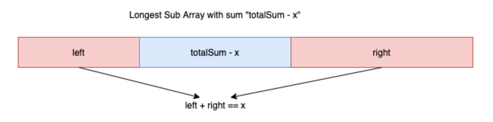

# Minimum Operations to Reduce X to Zero


You are given an integer array `nums` and an integer `x`. In one operation, you can either remove the leftmost or the rightmost element from the array `nums` and subtract its value from `x`. Note that this **modifies** the array for future operations.

Return _the **minimum number** of operations to reduce_ `x` _to **exactly**_ `0` _if it's possible, otherwise, return_ `-1`.

**Example 1:**

```text
Input: nums = [1,1,4,2,3], x = 5
Output: 2
Explanation: The optimal solution is to remove the last two elements to reduce x to zero.
```

**Example 2:**

```text
Input: nums = [5,6,7,8,9], x = 4
Output: -1
```

**Example 3:**

```text
Input: nums = [3,2,20,1,1,3], x = 10
Output: 5
Explanation: The optimal solution is to remove the last three elements and the first two elements (5 operations in t
```

### 思路:

shortest操作得到一个sum为x的subarry， 也就是找出longest subarray sum equals total - x。 



### code:

```java
class Solution {
    public int minOperations(int[] nums, int x) {
        Map<Integer,Integer> map = new HashMap<>();
        int max = Integer.MIN_VALUE, n = nums.length, sum = 0, total = 0;
        for(int i : nums) total += i;
        x = total - x; 
        //now find the longest subarray that sum to x;
        for(int i = 0; i < n; i++) {
            sum += nums[i];
            if(sum == x) {
                max = i + 1;
            }
            if(!map.containsKey(sum)){
                map.put(sum,i);
            }
            if(map.containsKey(sum - x)) {
                max = Math.max(max, i - map.get(sum - x));
            }
        }
        return (max == Integer.MIN_VALUE) ? -1 : n - max;
        
    }
}
```

